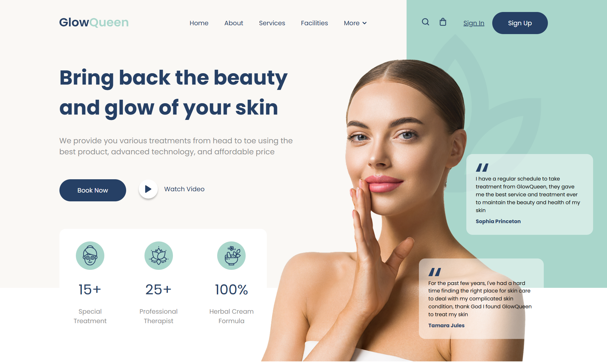

# 🌿 Spa Beauty Store

Modern landing page about a beauty and spa products store.  
Built using a modular architecture with **Vite**, **Sass (SCSS)**, and **modern JavaScript (ES Modules)**.

This project was developed as a frontend practice applying clean structure, scalable styling, and proper Git workflow management.

---

## 🚀 Live Demo

👉 **[View Live Project](https://cris100fire.github.io/spa-beauty-store/)**

---

## 🎥 Video Demo

📺 **[Watch Video](https://youtu.be/Vg8jzqtG2Gs)**

---

## 🛠️ Technologies Used

- 
- 
- 
- 
- 
- 
- 
- 

---

## ✨ Features

- Clean and modern UI design
- Modular project structure
- Scalable styling with Sass
- Optimized build process using Vite
- Clear separation between development and production environments
- Production-ready setup

---

## 📦 Installation & Use

- Clone the repository: `git clone https://github.com/Cris100Fire/spa-beauty-store.git
- Install dependencies: `npm run install`
- Run development server: `npm run dev`
- Build for production: `npm run build`
- Preview production build: `npm run preview`

---

## 📚 What I Learned

During this project I strengthened and learned:

- How to structure a modern Vite project
- Sass configuration in a professional environment
- JavaScript module organization
- Scalable folder architecture
- Difference between development and production builds
- Proper `.gitignore` usage
- Removing `node_modules` correctly from Git
- Handling Git conflicts
- Full GitHub workflow from local to remote

---

## 📌 Responsiveness

This landing page is currently optimized for desktop screens (~1536px width).  
It was designed as a desktop-focused layout and is not intended for mobile devices at this stage.

---

## 🚀 Future Improvements

- Make the design fully responsive
- Add advanced animations
- Implement shopping cart functionality
- Improve accessibility (ARIA, contrast, semantic HTML)
- Enhance SEO optimization

---

## 🤝 Contributions

Contributions are welcome! If you find any problems or have any suggestions for improvement, please open an issue or submit a pull request!

---

## 👨‍💻 Author

Developed by **Cristopher Cienfuegos**

---

## 📄 License

This project is licensed under the MIT License.
